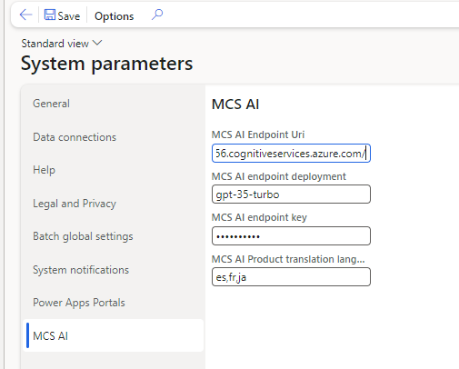
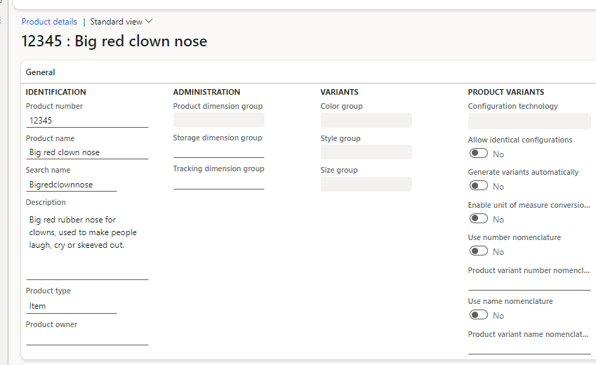
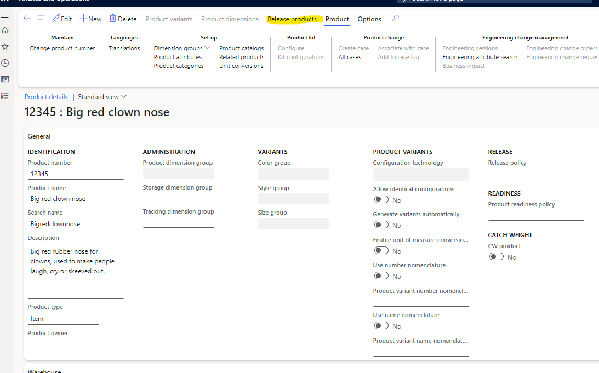
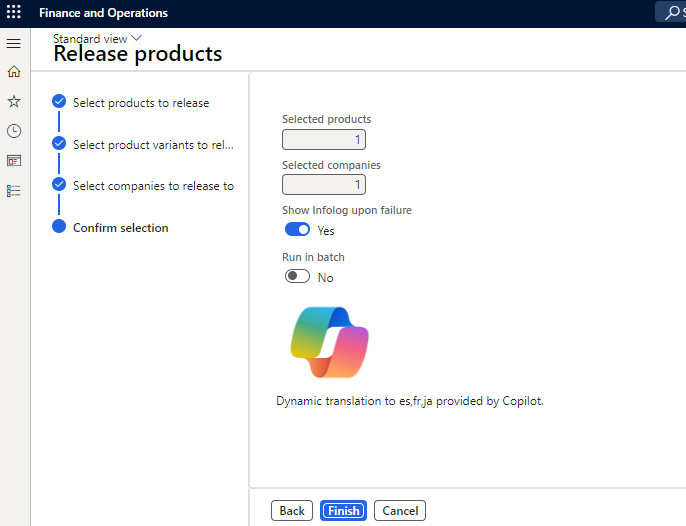
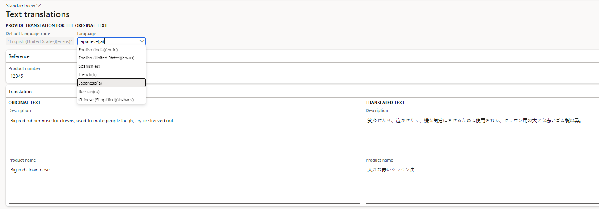

# Dynamics 365 FSCM AI Powered Product Translations 

A proof of concept that was entered into an internal Microsoft event called Hackathon.

This enhancement will use Microsoft AI to translate the name and description of your products to any languages you choose at the time they are released to your stores to be sold.

**Pre-requisites**
- A Dynamics FSCM environment
- Azure AI Studio

**There are 4 required parameters**

1. The AI endpoint Uri, typically in this format **https://my-aistudio.cognitiveservices.azure.com/**
2. The deployment you want to use
3. The secret key for the deployment (typically we'd use a key vault to store this but did not for the POC)
4. A comma separated list of language codes to translate the base language into.

Create a new or open and existing product.

Click on the **Release products** button

Follow the prompts, click the **Finish** button

Click on the Translations menu item

